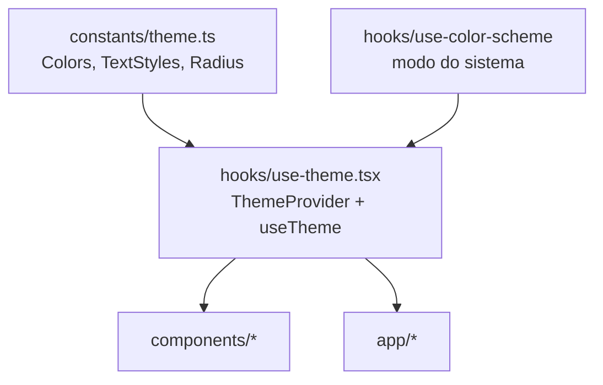

# Arquitetura

Estado em julho de 2026: existe a camada 1A — projeto, identidade visual e componentes base. Ainda não há banco de dados nem telas de agendamento.

## Visão geral

Aplicativo React Native com Expo, em TypeScript. O mesmo código gera três saídas: app Android, app iOS e site. É isso que permite a dona instalar o app e a cliente acessar por link, sem manter dois projetos ([DT-005](DECISOES.md)).

O roteamento é do Expo Router, que transforma a estrutura de arquivos em rotas: um arquivo em `src/app/` vira uma tela navegável.

## Organização do código

| Pasta | Responsabilidade | Regra |
|---|---|---|
| `src/app/` | Rotas. Cada arquivo é uma tela | Não escreve cor nem fonte à mão; consome de `useTheme` e dos componentes |
| `src/components/` | Componentes reutilizáveis | Lê o tema, não recebe cor por prop |
| `src/constants/` | Tema: cores, tipografia, raios, espaçamentos | Fonte única de valores visuais |
| `src/hooks/` | Hooks compartilhados | |
| `assets/` | Ícones e splash | |

O alias `@/` aponta para `src/` (configurado em `tsconfig.json`). Use `@/components/button`, não caminho relativo.

## Como o tema funciona

Este é o ponto que mais afeta o dia a dia de quem escreve tela.



`ThemeProvider` envolve o app inteiro em `src/app/_layout.tsx`. Ele decide entre paleta clara e escura e expõe tudo via `useTheme()`:

```tsx
const { colors, scheme, mode, setMode } = useTheme();
```

Por padrão segue o sistema operacional. `setMode('light' | 'dark' | 'system')` força um modo — usado hoje na tela de prévia e, no futuro, numa configuração do app.

**A regra que sustenta o resto:** nenhuma tela escreve cor à mão. Se aparecer um `#F4661F` fora de `src/constants/theme.ts`, o modo escuro vai quebrar naquele ponto e ninguém vai notar até alguém abrir o app à noite.

### Por que `useColorScheme` vem de `@/hooks/`, não do `react-native`

O web é gerado estaticamente (`"output": "static"` no `app.json`), então a página é montada no servidor antes de chegar ao navegador — e no servidor não existe modo escuro. O hook local devolve `light` até a hidratação e reavalia no cliente. Importar direto do `react-native` faria a página abrir clara e trocar para escura na frente do usuário, com aviso de hidratação no console.

## Fontes

Baloo 2 e Nunito vêm de `@expo-google-fonts` e são carregadas em `_layout.tsx`. A splash screen fica na tela até terminarem: sem isso o app abre com a fonte do sistema e troca no meio, o que dá um salto visual.

Telas nunca declaram `fontFamily`. Use `<AppText variant="…">`, que já aplica a fonte e o tamanho da variante.

## Componentes base

| Componente | Para que |
|---|---|
| `AppText` | Todo texto. Variantes: `title`, `heading`, `subheading`, `body`, `bodyBold`, `support`, `label` |
| `Button` | Variantes `primary` (laranja) e `secondary` (contorno) |
| `Card` | Superfície com borda e canto arredondado |

## Convenções

**Idioma.** Identificadores em inglês, interface em português. Ver [DT-013](DECISOES.md).

**Sem biblioteca de UI.** Tudo com `StyleSheet` e o módulo de tema. Ver [DT-012](DECISOES.md).

## O que ainda não existe

- **Divisão de rotas por público.** Hoje `src/app/index.tsx` é a tela de prévia da identidade. Na camada 2 entram os grupos `(cliente)` e `(dona)`, e essa tela sai.
- **Supabase.** Nenhuma conexão com banco ainda; é a camada 1B.
- **`docs/BANCO-DE-DADOS.md`.** Entra junto com o schema.
