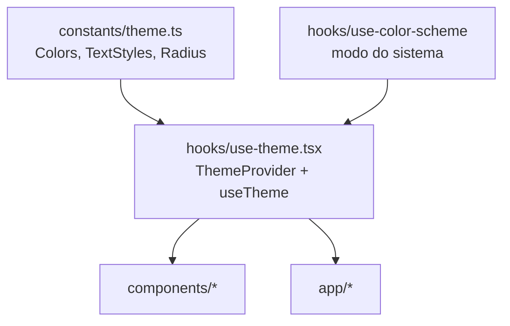

# Arquitetura

Estado em agosto de 2026: camadas 1 a 7. O app agenda, gerencia clientes, monta as mensagens de WhatsApp, guarda fotos e mostra o faturamento. Falta o refinamento (camada 8).

## Visão geral

Aplicativo React Native com Expo, em TypeScript. O mesmo código gera três saídas: app Android, app iOS e site. É isso que permite a dona instalar o app e a cliente acessar por link, sem manter dois projetos ([DT-005](DECISOES.md)).

O roteamento é do Expo Router, que transforma a estrutura de arquivos em rotas: um arquivo em `src/app/` vira uma tela navegável.

## Organização do código

| Pasta | Responsabilidade | Regra |
|---|---|---|
| `src/app/` | Rotas. Cada arquivo é uma tela | Não escreve cor nem fonte à mão; consome de `useTheme` e dos componentes |
| `src/components/` | Componentes reutilizáveis | Lê o tema, não recebe cor por prop |
| `src/constants/` | Tema: cores, tipografia, raios, espaçamentos | Fonte única de valores visuais |
| `src/hooks/` | Hooks compartilhados | |
| `src/lib/` | Integrações externas | Único lugar que fala com o Supabase |
| `supabase/migrations/` | Schema do banco, em SQL | |
| `assets/` | Ícones e splash | |

O alias `@/` aponta para `src/` (configurado em `tsconfig.json`). Use `@/components/button`, não caminho relativo.

## Como o tema funciona

Este é o ponto que mais afeta o dia a dia de quem escreve tela.



`ThemeProvider` envolve o app inteiro em `src/app/_layout.tsx`. Ele decide entre paleta clara e escura e expõe tudo via `useTheme()`:

```tsx
const { colors, scheme, mode, setMode } = useTheme();
```

Por padrão segue o sistema operacional. `setMode('light' | 'dark' | 'system')` força um modo, e a escolha é gravada no aparelho (`AsyncStorage`, chave `yaya:tema`) — não no banco, porque é preferência de quem olha a tela e cada aparelho pode querer a sua. O controle fica em `/dona/preferencias`.

A gravação é feita depois de aplicar na tela: esperar a escrita faria o toque parecer travado, e o pior caso de ela falhar é a escolha não sobreviver ao fechamento do app.

**A regra que sustenta o resto:** nenhuma tela escreve cor à mão. Se aparecer um `#F4661F` fora de `src/constants/theme.ts`, o modo escuro vai quebrar naquele ponto e ninguém vai notar até alguém abrir o app à noite.

### Por que `useColorScheme` vem de `@/hooks/`, não do `react-native`

O web é gerado estaticamente (`"output": "static"` no `app.json`), então a página é montada no servidor antes de chegar ao navegador — e no servidor não existe modo escuro. O hook local devolve `light` até a hidratação e reavalia no cliente. Importar direto do `react-native` faria a página abrir clara e trocar para escura na frente do usuário, com aviso de hidratação no console.

## Fontes

Baloo 2 e Nunito vêm de `@expo-google-fonts` e são carregadas em `_layout.tsx`. A splash screen fica na tela até terminarem: sem isso o app abre com a fonte do sistema e troca no meio, o que dá um salto visual.

Telas nunca declaram `fontFamily`. Use `<AppText variant="…">`, que já aplica a fonte e o tamanho da variante.

## Componentes base

| Componente | Para que |
|---|---|
| `AppText` | Todo texto. Variantes: `title`, `heading`, `subheading`, `body`, `bodyBold`, `support`, `label` |
| `Button` | Variantes `primary` (laranja) e `secondary` (contorno) |
| `Card` | Superfície com borda e canto arredondado |
| `TextField` | Campo de texto com rótulo e erro |
| `Toggle` | Liga/desliga na paleta da marca |
| `DragScroll` | Faixa horizontal que arrasta também com o mouse |
| `CaptionField` | Texto curto preso a uma foto — legenda ou observação |
| `PaymentPicker` | "Pagou como?" — Pix, dinheiro, cartão |

`DragScroll` existe porque no celular o toque já arrasta, mas no navegador não: rolagem horizontal só responde a barra ou à roda com Shift. Quem está no computador tenta arrastar, não consegue, e conclui que a faixa travou. O cursor de mãozinha é o que avisa que dá.

`CaptionField` grava por botão, e não ao sair do campo. O `TextField` espalha as props recebidas depois de definir o próprio `onBlur`, então um `onBlur` vindo de fora o substituiria e o realce de foco pararia de funcionar. O botão só aparece quando há algo a gravar — botão que não faz nada vira ruído.

`Toggle` existe porque o `Switch` do React Native ignora as cores informadas em algumas plataformas e insiste no verde do sistema, destoando de um app em laranja e lavanda. Ele também define `aria-checked` explicitamente: o React Native Web não traduz `accessibilityState.checked` para o atributo do navegador, e sem isso um leitor de tela anuncia o controle sem dizer se está ligado.

## Convenções

**Idioma.** Identificadores em inglês, interface em português. Ver [DT-013](DECISOES.md).

**Sem biblioteca de UI.** Tudo com `StyleSheet` e o módulo de tema. Ver [DT-012](DECISOES.md).

## Acesso a dados

Só `src/lib/` conversa com o banco. Telas não chamam o Supabase direto — elas importam funções com nome de intenção, e é isso que mantém as consultas em um lugar só quando uma regra mudar.

| Módulo | Cuida de |
|---|---|
| `supabase.ts` | O cliente e as credenciais |
| `services.ts` | Serviços. `listActiveServices` é o que a cliente vê; `listAllServices` inclui desativados, para a dona |
| `business-hours.ts` | Faixas por dia da semana |
| `schedule-exceptions.ts` | Ajustes por data que substituem o padrão semanal |
| `settings.ts` | A linha única de preferências |
| `format.ts` | Preço, duração e horário — formatar e ler de volta |
| `calendar.ts` | Datas e a grade do mês |
| `pricing.ts` | Desconto e preço final |
| `whatsapp.ts` | Texto das mensagens e o endereço da conversa |
| `photos.ts` | Galeria e fotos de atendimento — os dois depósitos |
| `payment.ts` | As formas de pagamento e seus rótulos |
| `finance.ts` | Faturamento: busca o período e soma |

`pricing.ts` e `calendar.ts` não tocam no banco de propósito: são as duas contas que dão errado em silêncio — centavo de arredondamento e virada de mês — e ficar fora da camada de dados permite testá-las sem subir o app.

`whatsapp.ts` também não importa nada — nem o `react-native`, nem o formatador de moeda. Por isso recebe o preço já pronto e devolve o endereço da conversa em vez de abri-la: abrir é uma linha em quem chama, e em troca o texto e o número podem ser conferidos fora do app.

O número é a parte que mais compensa testar. Um prefixo errado não dá erro: manda a mensagem para um estranho. E há uma armadilha — **DDD 55 é do Rio Grande do Sul**, então um celular gaúcho começa com 55 sem que 55 seja o código do país. Distinguir só pelo prefixo erraria com essas clientes.

`pricing.ts` vai além e **não importa nada**, nem o calendário: a data de hoje entra por parâmetro. Uma função que consulta o relógio por dentro não pode ser exercitada em outra data, e "só quebra dia 31" é o tipo de defeito que ninguém reproduz. Quem chama passa `todayISO()`.

### A borda do dia é onde o faturamento erra em silêncio

`starts_at` é um instante; o dia da dona começa à meia-noite **do fuso dela**, não do servidor. Filtrar com o texto `"2026-08-06T00:00:00"` faz o Postgres ler aquilo em UTC, e no Brasil isso empurra o atendimento das 21h para o dia seguinte: some de um dia e reaparece no outro.

Por isso `calendar.ts` expõe `dayStartInstant` e `dayAfterInstant`, que constroem o instante a partir da data local, e `finance.ts` filtra com eles — início inclusivo, fim exclusivo, sem `23:59:59`.

O erro nunca aparece no total do mês, só no total do dia, e só para quem atende à noite. É o tipo de defeito que se atribui a "o app está errado" sem nunca se reproduzir. Está coberto por teste.

`Period`, `periodRange` e `previousPeriodRange` também moram em `calendar.ts`, e não junto das consultas, pelo mesmo motivo de `pricing.ts`: é conta de calendário — virada de mês, virada de ano, semana que começa no domingo — e ficar fora da camada de dados permite conferir sem subir o app.

### Formato de data na interface

A dona escreve `31/05/2026`; o banco guarda `2026-05-31`. `parseBRDate` faz a tradução e recusa data que não existe no calendário, como `31/02`. O formato do banco não é o formato de quem usa o app.

### Datas circulam como texto, nunca como `Date`

`calendar.ts` trabalha com `"AAAA-MM-DD"`. Um `Date` é um instante no tempo, e converter instante para dia depende de fuso: `2026-08-10T00:00Z` é dia 9 no Brasil.

O sintoma disso aparece só para quem agenda perto da meia-noite, que é justamente o caso mais difícil de reproduzir e o mais fácil de culpar o usuário. Texto de data não tem essa ambiguidade.

As funções são puras e cobertas por teste de virada de mês, virada de ano e ano bissexto.

Quem protege os dados são as políticas de acesso do banco — o desenho delas está em [BANCO-DE-DADOS.md](BANCO-DE-DADOS.md).

As credenciais vêm de `EXPO_PUBLIC_SUPABASE_URL` e `EXPO_PUBLIC_SUPABASE_ANON_KEY`. O prefixo `EXPO_PUBLIC_` é obrigatório: sem ele o Expo não expõe a variável ao código do app. Se faltar alguma, o app falha na abertura com uma mensagem dizendo o que fazer — melhor que uma tela em branco e `undefined` no console.

## Autenticação

Dois públicos, dois tratamentos:

- **A cliente não tem login.** Identifica-se por nome e telefone ao agendar ([DT-004](DECISOES.md)).
- **A dona entra com email e senha**, e a sessão é persistida — ela digita a senha uma vez ([DT-014](DECISOES.md)).

`src/hooks/use-auth.tsx` expõe o estado de login. O ponto a entender é que ele devolve **dois** sinais diferentes:

| Campo | Significa |
|---|---|
| `session` | Está autenticada em alguma conta |
| `isOwner` | A conta corresponde a uma profissional ativa do salão |

**As telas de gestão checam `isOwner`, nunca apenas `session`.** O Supabase permite cadastro aberto: alguém pode criar uma conta no projeto e ficar com `session` válida. Só o vínculo com `professionals` caracteriza a dona, e o banco aplica a mesma regra pelas políticas de acesso — a checagem na tela é conveniência, não é a proteção.

`src/app/dona/_layout.tsx` é onde isso vira código: sem sessão, redireciona para `/entrar`; com sessão mas sem vínculo, mostra uma tela explicando que aquela conta não tem acesso.

### Rotas

| Rota | O que é |
|---|---|
| `/` | Agendamento pela cliente |
| `/agendamento/[id]` | O agendamento dela, pelo código |
| `/entrar` | Login da dona |
| `/dona` | **Agenda** — a tela do dia a dia |
| `/dona/agendar` | Lançamento de agendamento pela dona |
| `/dona/configuracao` | Painel de configuração |
| `/dona/clientes` | Lista de clientes |
| `/dona/cliente/[id]` | Ficha e histórico de uma cliente |
| `/dona/retorno` | Quem passou do prazo e ainda não remarcou |
| `/dona/galeria` | Vitrine de trabalhos |
| `/dona/fotos/[id]` | Fotos de um atendimento. `id` é o do agendamento |
| `/dona/financeiro` | Faturamento por dia, semana e mês |
| `/dona/servicos` | Lista de serviços |
| `/dona/servico/[id]` | Cadastro e edição. `id` vale `novo` para criar |
| `/dona/horarios` | Padrão semanal de atendimento |
| `/dona/disponibilidade` | Calendário de exceções: folgas, férias, dias fora do padrão |
| `/dona/preferencias` | Aprovação, cancelamento, prazo de retorno |

Tudo sob `/dona` passa pelo guardião de `src/app/dona/_layout.tsx`.

**Rota nova não existe para o TypeScript até o servidor reiniciar.** Os tipos de rota são gerados em `.expo/types/`, e criar o arquivo da tela não basta para `npx tsc --noEmit` aceitar o endereço. Enquanto isso, empurre pela forma de objeto, que sempre funciona:

```tsx
router.push({ pathname: '/dona/fotos/[id]', params: { id } });
```

### A tela da cliente é uma só

Serviços, data, horário e dados aparecem como etapas na mesma tela, conforme ela avança. Em celular, trocar de tela a cada passo faz perder o contexto do que já foi escolhido, e voltar para corrigir vira aventura.

Trocar de serviço limpa o horário escolhido de propósito: a duração muda, e o horário pode não caber mais. Manter uma escolha que virou inválida é pior que pedir para escolher de novo.

`src/lib/booking.ts` é o único caminho: nada ali monta consulta na tabela de agendamentos, tudo passa pelas funções do banco.

### A agenda da dona consulta as tabelas direto

`src/lib/agenda.ts` é a exceção, e de propósito: a política de acesso já reconhece a dona, e ela pode ver tudo. As funções do banco existem para proteger a cliente, que não pode — usá-las aqui só acrescentaria uma camada sem proteger nada.

## O que ainda não existe

Refinamento (camada 8): acertar o que o uso real mostrar. Ver o [README](../README.md).
