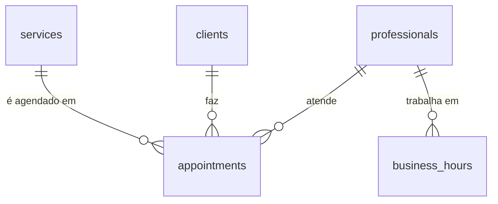

# Banco de dados

Postgres hospedado no Supabase, região São Paulo (`sa-east-1`).

O schema vive em `supabase/migrations/`. Para aplicar: painel do Supabase → **SQL Editor** → colar o arquivo → **Run**.

## Diagrama



## Tabelas

### `professionals`

Profissionais que atendem. Uma linha por enquanto ([DT-007](DECISOES.md)).

| Coluna | Tipo | Observação |
|---|---|---|
| `id` | uuid | |
| `name` | text | |
| `active` | boolean | Inativa some do catálogo público |

### `services`

| Coluna | Tipo | Observação |
|---|---|---|
| `id` | uuid | |
| `name` | text | |
| `price_cents` | integer | **Centavos**, não decimal — ver abaixo |
| `duration_minutes` | integer | Define quais horários cabem na agenda |
| `active` | boolean | |
| `sort_order` | integer | Ordem de exibição para a cliente |

### `clients`

| Coluna | Tipo | Observação |
|---|---|---|
| `id` | uuid | |
| `name` | text | |
| `phone` | text | **Único.** É a identidade da cliente, já que não há senha ([DT-004](DECISOES.md)). Guardar só dígitos |
| `birth_date` | date | |
| `preferences` | text | Formato, tamanho, cores que ela gosta |
| `notes` | text | Observações livres |

Não há campo de dados de saúde. A anamnese fica em papel ([DT-010](DECISOES.md)), e por isso o app não guarda informação sensível de saúde.

### `appointments`

| Coluna | Tipo | Observação |
|---|---|---|
| `id` | uuid | |
| `client_id` | uuid | → `clients.id` |
| `service_id` | uuid | → `services.id` |
| `professional_id` | uuid | → `professionals.id` |
| `starts_at` | timestamptz | |
| `ends_at` | timestamptz | Calculado a partir da duração do serviço |
| `status` | text | `pendente`, `confirmado`, `cancelado`, `concluido` |
| `price_cents` | integer | **Cópia** do preço no momento da marcação |
| `notes` | text | |

### `schedule_exceptions`

Ajustes de agenda para datas específicas, que substituem o padrão semanal ([DT-016](DECISOES.md)).

| Coluna | Tipo | Regra |
|---|---|---|
| `professional_id` | uuid | → `professionals.id` |
| `date` | date | Junto com `professional_id`, é a chave primária |
| `opens_at` | time | Nulo junto com `closes_at` significa **fechado o dia todo** |
| `closes_at` | time | |
| `note` | text | Motivo, de uso interno. **Não é legível pela chave pública** |

A exceção tanto abre quanto fecha, e é isso que faz o modelo servir para quem tem rotina estável e para quem não tem nenhuma:

| Situação | Como fica |
|---|---|
| Fechar uma quinta específica | Linha na data, sem horário |
| Naquele sábado só de manhã | Linha na data, 09:00–12:00 |
| Atender num domingo fora do padrão | Linha na data, com horário |
| Férias | Uma linha por dia do período |

### `business_hours`

Chave primária composta por `(professional_id, weekday)` — uma faixa por dia da semana.

`weekday` segue a convenção do JavaScript: `0` = domingo, `6` = sábado.

### `settings`

Tabela de uma linha só. A chave primária é um boolean que só aceita `true`, então uma segunda linha é impossível — evita o clássico "qual das duas configurações vale?".

| Coluna | Padrão | Para que |
|---|---|---|
| `require_approval` | `true` | Dona aprova cada agendamento ([DT-008](DECISOES.md)) |
| `allow_client_cancel` | `true` | Cliente cancela sozinha |
| `maintenance_reminder_days` | `21` | Dias até a cliente entrar na lista de retorno |
| `booking_window_days` | `14` | Até quantos dias à frente a agenda aceita marcação |
| `minimum_notice_hours` | `3` | Antecedência mínima para marcar |

> ⚠️ **A confirmar:** `maintenance_reminder_days` está em 21 por suposição. Qual é o prazo real de manutenção? Varia por serviço?

> ⚠️ **A confirmar:** intervalo entre atendimentos, para limpeza e preparo. Entra no cálculo de disponibilidade e ainda não existe no schema.

## Uma armadilha ao consultar `schedule_exceptions`

A coluna `note` é restrita por permissão de coluna, não por RLS — RLS controla linha, e liberar a linha para a cliente entregaria o motivo junto ("consulta médica", "viagem").

A consequência prática: **`select('*')` nessa tabela é recusado para a chave pública**, porque `*` inclui `note`. Consultas do lado da cliente precisam listar as colunas:

```ts
.select('professional_id, date, opens_at, closes_at')
```

O erro, se esquecer, é `permission denied for table schedule_exceptions` — que sugere falta de permissão e leva para o caminho errado. A tentação vira conceder acesso total, reabrindo o buraco.

## Duas escolhas que merecem explicação

### Dinheiro em centavos, não em decimal

`price_cents` é `integer`. Guardar dinheiro como número de ponto flutuante acumula erro de arredondamento, e isso aparece no relatório de faturamento como centavos que não fecham. Um preço de R$ 120,00 é `12000`.

### O preço é copiado para o agendamento

`appointments.price_cents` duplica o valor de `services.price_cents` de propósito, no momento da marcação.

Sem essa cópia, aumentar o preço de um serviço reescreveria o histórico: o faturamento do mês passado mudaria sozinho, e o que a cliente pagou deixaria de bater com o que está registrado.

## A trava de horário

O ponto que justificou escolher Postgres em vez de Firestore ([DT-002](DECISOES.md)):

```sql
alter table appointments add constraint sem_sobreposicao
  exclude using gist (
    professional_id with =,
    tstzrange(starts_at, ends_at) with &&
  ) where (status in ('pendente', 'confirmado'));
```

Duas clientes agendando o mesmo horário no mesmo instante: o banco recusa a segunda. Isso **não** depende de o app ter checado antes — e é exatamente na disputa simultânea que a checagem no app falha, porque as duas leem "livre" antes de qualquer uma escrever.

O `where` deixa de fora `cancelado` e `concluido`: horário cancelado volta a ficar livre, e atendimento concluído não deve bloquear uma remarcação no mesmo espaço.

## Regras de acesso (RLS)

RLS ligado em todas as tabelas. **Sem política, ninguém lê nem escreve** — o padrão é negar.

| Tabela | Quem lê | Quem escreve |
|---|---|---|
| `services` | Qualquer um, se `active` · a dona vê todos | A dona |
| `professionals` | Qualquer um, se `active` | A dona (só a própria linha) |
| `business_hours` | Qualquer um | A dona |
| `clients` | A dona | A dona |
| `appointments` | A dona | A dona |
| `settings` | A dona | A dona |

As três primeiras são o catálogo: a cliente precisa ver serviços e horários para conseguir agendar. Dados pessoais só a dona enxerga.

A cliente ainda não escreve nada — o fluxo de agendamento entra na camada 3, com políticas próprias.

### Quem é "a dona", do ponto de vista do banco

Não é "quem está autenticado". O Supabase permite cadastro aberto, então essa definição trataria qualquer pessoa que criasse uma conta no projeto como administradora do salão.

A tabela `professionals` tem uma coluna `auth_user_id` que aponta para `auth.users`. A função `is_owner()` verifica se existe uma profissional **ativa** cujo `auth_user_id` é o usuário logado, e é ela que todas as políticas de escrita consultam:

```sql
create or replace function is_owner()
returns boolean language sql stable security definer set search_path = public as $$
  select exists (
    select 1 from professionals
    where auth_user_id = auth.uid() and active
  );
$$;
```

Uma conta criada por fora autentica normalmente, mas não corresponde a nenhuma linha e não enxerga nada.

O `security definer` é necessário: a função precisa ler `professionals` ignorando o RLS dessa mesma tabela, senão a política que a chama entra em recursão infinita. O `set search_path` que acompanha impede que um schema no caminho de busca sequestre os nomes usados dentro dela — cuidado padrão com funções `security definer`.

A conta é ligada à profissional por `supabase/migrations/0003_vincula_conta.sql`. O email real não fica versionado ali de propósito: é dado pessoal, e uma vez commitado permanece no histórico do git.

## Conexão a partir do app

`src/lib/supabase.ts`. As credenciais vêm de variáveis de ambiente:

```
EXPO_PUBLIC_SUPABASE_URL
EXPO_PUBLIC_SUPABASE_ANON_KEY
```

Copie `.env.example` para `.env` e preencha. O `.env` não vai para o Git.

A chave `anon` é pública por natureza — quem protege os dados é o RLS, não o segredo da chave. Já a `service_role` **ignora todas as políticas** e nunca deve entrar no app nem no repositório.

## Dados de exemplo

A migration insere serviços e horários fictícios (terça a sábado, 9h às 18h) para o app ter o que mostrar enquanto a tela de configuração não existe.

> ⚠️ **A confirmar:** a lista real de serviços com preço e duração, e os dias e horários de atendimento.
