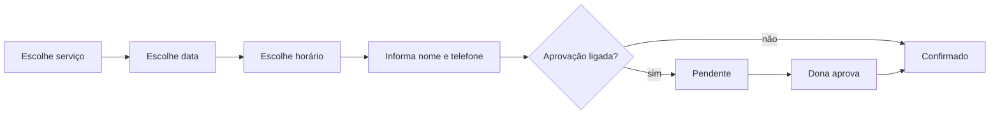

# Funcionalidades

> Escopo acordado em julho de 2026. Cada funcionalidade indica em qual camada entra — a ordem está no [README](../README.md). As camadas 1 e 2 estão construídas; da 3 em diante, este documento descreve o combinado, não o que existe.

## Perfis de usuário

| Perfil | Quem é | Como acessa | O que pode fazer |
|---|---|---|---|
| Dona do salão | Quem atende | App instalado, com login | Tudo: agenda, clientes, serviços, horários, fotos, financeiro |
| Cliente | Quem marca horário | Link no navegador, sem instalar | Ver serviços, agendar, cancelar, ver os próprios agendamentos |

A cliente não tem senha. Ela é identificada pelo telefone informado ao agendar, e o navegador dela guarda quem ela é. Não existe tela de consulta por telefone — o porquê está em [DT-004](DECISOES.md).

A dona tem login por email e senha, vinculado à profissional cadastrada ([DT-014](DECISOES.md)).

---

## Entrar no app
**Camada 2** · quem usa: dona

Tela de email e senha. Uma vez logada, o app guarda a sessão — na prática a senha é digitada uma vez e não volta a aparecer.

Não há tela de cadastro. A conta é criada uma única vez, por fora, e ligada à linha da profissional no banco. Conta criada por fora desse vínculo não enxerga nada.

---

## Configurar o salão
**Camada 2** · quem usa: dona

Onde a dona substitui os dados de exemplo pelos reais. Foi promovida da última para a segunda camada porque a lógica de horários livres precisa ser construída sobre dados verdadeiros ([DT-015](DECISOES.md)).

### Serviços

Cadastrar, editar, reordenar e desativar. Cada serviço tem nome, preço e duração.

Desativar em vez de apagar: serviço que já foi agendado não pode sumir, senão o histórico e o faturamento ficam com buracos.

Cada serviço também declara seu **tempo de arrumação** — os minutos de limpeza e preparo depois do atendimento. Depende do procedimento, não do salão ([DT-017](DECISOES.md)): a agenda bloqueia esse tempo, e a cliente não o vê.

### Horários de atendimento

O padrão semanal: que dias atende e de que hora a que hora.

### Disponibilidade

O calendário onde a dona ajusta as datas que fogem do padrão ([DT-016](DECISOES.md)). Tocando num dia, ela escolhe:

| Opção | Efeito |
|---|---|
| Padrão | Aquele dia volta a seguir o padrão semanal |
| Não atender | Fecha o dia, mesmo que o padrão diga que atende |
| Horário diferente | Uma faixa própria só naquela data |

Há também um atalho para fechar um período inteiro — férias, viagem — sem marcar dia por dia.

Cada exceção aceita um motivo, visível só para a dona. A cliente enxerga que o dia está fechado, não o porquê.

**Como usar sem ter rotina fixa:** deixando o padrão semanal vazio e abrindo data por data, o mesmo calendário atende quem não tem semana igual à outra.

### Preferências

| Configuração | Padrão | O que muda |
|---|---|---|
| Aprovar cada agendamento | ligado | Desligado, o horário já nasce confirmado |
| Cliente pode cancelar sozinha | ligado | Desligado, ela precisa falar com a dona |
| Prazo de retorno | 21 dias | Quantos dias até a cliente entrar na lista de quem está na hora de voltar |
| Agenda aberta por | 14 dias | Até quando à frente a cliente consegue marcar |
| Antecedência mínima | 3 horas | Quanto tempo antes, no mínimo, ela pode marcar |

As duas primeiras são chaves justamente para poderem mudar sem mexer no código ([DT-008](DECISOES.md)).

---

## Agendar um horário
**Camada 3** · quem usa: cliente

### Passo a passo

1. A cliente abre o link e vê a lista de serviços, cada um com preço e duração
2. Escolhe um serviço
3. Escolhe a data num calendário. Dias sem vaga aparecem desabilitados
4. Escolhe entre os horários disponíveis daquele dia
5. Informa nome e telefone
6. Confirma

O que acontece depois depende da configuração: com aprovação manual ligada, o agendamento fica **pendente** até a dona confirmar; desligada, já nasce **confirmado**.

### Regras

- Os horários oferecidos respeitam a duração do serviço: um serviço de 2h30 não aparece às 17h se o salão fecha às 18h
- Um horário ocupado não é oferecido a mais ninguém — a garantia é do banco de dados, não da tela, para que duas clientes agendando ao mesmo tempo não consigam pegar a mesma vaga

> ⚠️ **A confirmar:** antecedência mínima para agendar (poder marcar para daqui a uma hora?) e até quanto tempo no futuro a agenda fica aberta.

> ⚠️ **A confirmar:** intervalo entre atendimentos, para limpeza e preparo.

### O que pode dar errado

| Situação | O que o app faz |
|---|---|
| Alguém pegou o horário durante o preenchimento | Avisa e recarrega os horários disponíveis |
| Sem internet | Mostra erro; o agendamento não é salvo |

---

## Ver e gerenciar a agenda
**Camada 3** · quem usa: dona

A tela principal do app. Mostra os agendamentos do dia e dos próximos dias, com destaque para os que estão pendentes de aprovação.

Ações sobre um agendamento: aprovar, recusar, cancelar, marcar como concluído.

---

## Cancelar um agendamento
**Camada 3** · quem usa: cliente e dona

A cliente pode cancelar a qualquer momento, e o horário volta a ficar disponível. Este comportamento é uma configuração — se o cancelamento em cima da hora virar problema, dá para restringir a um prazo mínimo sem mexer no código ([DT-008](DECISOES.md)).

A dona pode cancelar qualquer agendamento.

---

## Ficha e histórico da cliente
**Camada 4** · quem usa: dona

Cada cliente tem uma ficha com:

- Nome e telefone
- Observações livres
- Preferências de unha (formato, tamanho, cores)
- Aniversário
- Histórico de atendimentos, com data, serviço e valor

A anamnese **não** faz parte do app: o salão usa ficha física ([DT-010](DECISOES.md)). Como consequência, o app não guarda nenhum dado de saúde — nem um campo curto de alergias.

---

## Avisos por WhatsApp
**Camada 5** · quem usa: dona

O app não envia nada sozinho. Ele monta a mensagem e abre o WhatsApp para a dona apertar enviar.

Três momentos geram mensagem:

| Momento | Conteúdo |
|---|---|
| Agendamento confirmado | Confirmação com serviço, data e horário |
| Véspera do atendimento | Lembrete |
| Cliente passou do prazo de retorno | Convite para remarcar |

---

## Lembrete de retorno
**Camada 5** · quem usa: dona

Alongamento pede manutenção periódica. O app mostra uma lista de clientes que passaram do prazo desde o último atendimento e ainda não remarcaram, com a mensagem de WhatsApp pronta para enviar.

O prazo é definido pela dona na configuração.

---

## Fotos dos trabalhos
**Camada 6**

Dois usos distintos:

- **Galeria** — vitrine pública, visível para a cliente enquanto escolhe o serviço, para inspirar
- **Registro do atendimento** — foto anexada ao histórico da cliente, para a dona lembrar do que foi feito e acompanhar a saúde da unha

A cliente não envia foto de referência ao agendar.

---

## Faturamento
**Camada 7** · quem usa: dona

Total faturado por período (semana e mês) e quais serviços dão mais retorno. Como cada agendamento já carrega o preço praticado no momento da marcação, o cálculo sai dos dados que já existem.

---

## Fora de escopo por enquanto

- Cobrança de sinal ou qualquer pagamento pelo app ([DT-009](DECISOES.md))
- Anamnese digital ([DT-010](DECISOES.md))
- Envio automático de WhatsApp ([DT-006](DECISOES.md))
- Mais de uma profissional na interface — o banco já suporta ([DT-007](DECISOES.md))
- Publicação nas lojas de aplicativo ([DT-005](DECISOES.md))

> ⚠️ **A confirmar:** "Yaya Kawaii Nails" é o nome definitivo que aparece para a cliente?
