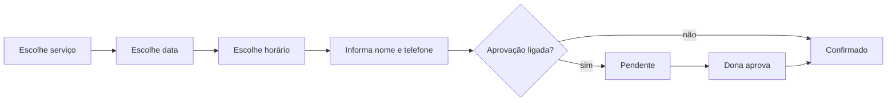

# Funcionalidades

> **Nada aqui está implementado ainda.** Este documento registra o escopo acordado em julho de 2026, para servir de referência durante a construção. Cada funcionalidade indica em qual camada entra — a ordem está no [README](../README.md).

## Perfis de usuário

| Perfil | Quem é | Como acessa | O que pode fazer |
|---|---|---|---|
| Dona do salão | Quem atende | App instalado no celular | Tudo: agenda, clientes, serviços, horários, fotos, financeiro |
| Cliente | Quem marca horário | Link no navegador, sem instalar | Ver serviços, agendar, cancelar, ver os próprios agendamentos |

A cliente não tem senha. Ela é identificada pelo telefone informado ao agendar, e o navegador dela guarda quem ela é. Não existe tela de consulta por telefone — o porquê está em [DT-004](DECISOES.md#dt-004--identificação-por-nome-e-telefone-sem-senha).

---

## Agendar um horário
**Camada 2** · quem usa: cliente

### Passo a passo

1. A cliente abre o link e vê a lista de serviços, cada um com preço e duração
2. Escolhe um serviço
3. Escolhe a data num calendário. Dias sem vaga aparecem desabilitados
4. Escolhe entre os horários disponíveis daquele dia
5. Informa nome e telefone
6. Confirma

O que acontece depois depende da configuração: com aprovação manual ligada, o agendamento fica **pendente** até a dona confirmar; desligada, já nasce **confirmado**.

### Regras

- Os horários oferecidos respeitam a duração do serviço: um serviço de 2h30 não aparece às 17h se o salão fecha às 18h
- Um horário ocupado não é oferecido a mais ninguém — a garantia é do banco de dados, não da tela, para que duas clientes agendando ao mesmo tempo não consigam pegar a mesma vaga

> ⚠️ **A confirmar:** antecedência mínima para agendar (poder marcar para daqui a uma hora?) e até quanto tempo no futuro a agenda fica aberta.

> ⚠️ **A confirmar:** intervalo entre atendimentos, para limpeza e preparo.

### O que pode dar errado

| Situação | O que o app faz |
|---|---|
| Alguém pegou o horário durante o preenchimento | Avisa e recarrega os horários disponíveis |
| Sem internet | Mostra erro; o agendamento não é salvo |

---

## Ver e gerenciar a agenda
**Camada 2** · quem usa: dona

A tela principal do app. Mostra os agendamentos do dia e dos próximos dias, com destaque para os que estão pendentes de aprovação.

Ações sobre um agendamento: aprovar, recusar, cancelar, marcar como concluído.

---

## Cancelar um agendamento
**Camada 2** · quem usa: cliente e dona

A cliente pode cancelar a qualquer momento, e o horário volta a ficar disponível. Este comportamento é uma configuração — se o cancelamento em cima da hora virar problema, dá para restringir a um prazo mínimo sem mexer no código ([DT-008](DECISOES.md#dt-008--aprovação-e-cancelamento-como-configuração-não-regra-fixa)).

A dona pode cancelar qualquer agendamento.

---

## Ficha e histórico da cliente
**Camada 3** · quem usa: dona

Cada cliente tem uma ficha com:

- Nome e telefone
- Observações livres
- Preferências de unha (formato, tamanho, cores)
- Aniversário
- Histórico de atendimentos, com data, serviço e valor

> ⚠️ **A confirmar:** o campo de alergias e sensibilidades permanece? A anamnese completa ficou no papel ([DT-010](DECISOES.md#dt-010--anamnese-fica-no-papel-fora-do-app)), e falta decidir se um campo curto de alerta ainda vale na tela.

A anamnese **não** faz parte do app. O salão usa ficha física.

---

## Avisos por WhatsApp
**Camada 4** · quem usa: dona

O app não envia nada sozinho. Ele monta a mensagem e abre o WhatsApp para a dona apertar enviar.

Três momentos geram mensagem:

| Momento | Conteúdo |
|---|---|
| Agendamento confirmado | Confirmação com serviço, data e horário |
| Véspera do atendimento | Lembrete |
| Cliente passou do prazo de retorno | Convite para remarcar |

---

## Lembrete de retorno
**Camada 4** · quem usa: dona

Alongamento pede manutenção periódica. O app mostra uma lista de clientes que passaram do prazo desde o último atendimento e ainda não remarcaram, com a mensagem de WhatsApp pronta para enviar.

> ⚠️ **A confirmar:** quantos dias após o atendimento a cliente entra nessa lista. Varia por serviço?

---

## Fotos dos trabalhos
**Camada 5**

Dois usos distintos:

- **Galeria** — vitrine pública, visível para a cliente enquanto escolhe o serviço, para inspirar
- **Registro do atendimento** — foto anexada ao histórico da cliente, para a dona lembrar do que foi feito e acompanhar a saúde da unha

A cliente não envia foto de referência ao agendar.

---

## Faturamento
**Camada 6** · quem usa: dona

Total faturado por período (semana e mês) e quais serviços dão mais retorno. Como cada agendamento já carrega o preço do serviço, o cálculo sai dos dados que já existem.

---

## Configurações
**Camada 7** · quem usa: dona

| Configuração | Valor inicial |
|---|---|
| Dias e horários de atendimento | ⚠️ a definir |
| Bloqueio de férias e folgas | — |
| Cadastro de serviços (nome, preço, duração) | ⚠️ a definir |
| Aprovar cada agendamento | ligado |
| Cliente pode cancelar sozinha | ligado |

> ⚠️ **A confirmar:** a lista de serviços com preço e duração, e os dias e horários de atendimento. Sem esses dados o app pode ser construído com valores de exemplo, mas não usado de verdade.

---

## Fora de escopo por enquanto

- Cobrança de sinal ou qualquer pagamento pelo app ([DT-009](DECISOES.md#dt-009--sem-cobrança-de-sinal-na-primeira-versão))
- Anamnese digital ([DT-010](DECISOES.md#dt-010--anamnese-fica-no-papel-fora-do-app))
- Envio automático de WhatsApp ([DT-006](DECISOES.md#dt-006--whatsapp-com-envio-manual-não-automático))
- Mais de uma profissional na interface — o banco já suporta ([DT-007](DECISOES.md#dt-007--banco-preparado-para-várias-profissionais-desde-o-início))
- Publicação nas lojas de aplicativo ([DT-005](DECISOES.md#dt-005--clientes-acessam-por-link-no-navegador))

> ⚠️ **A confirmar:** "Yaya Kawaii Nails" é o nome definitivo que aparece para a cliente?
